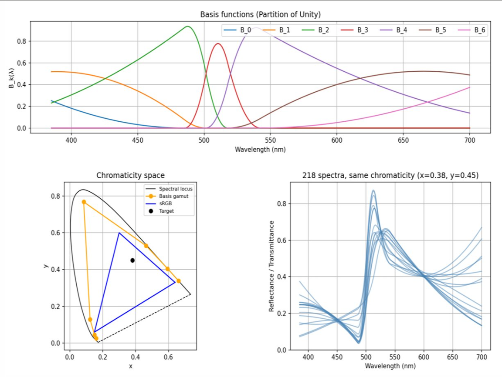
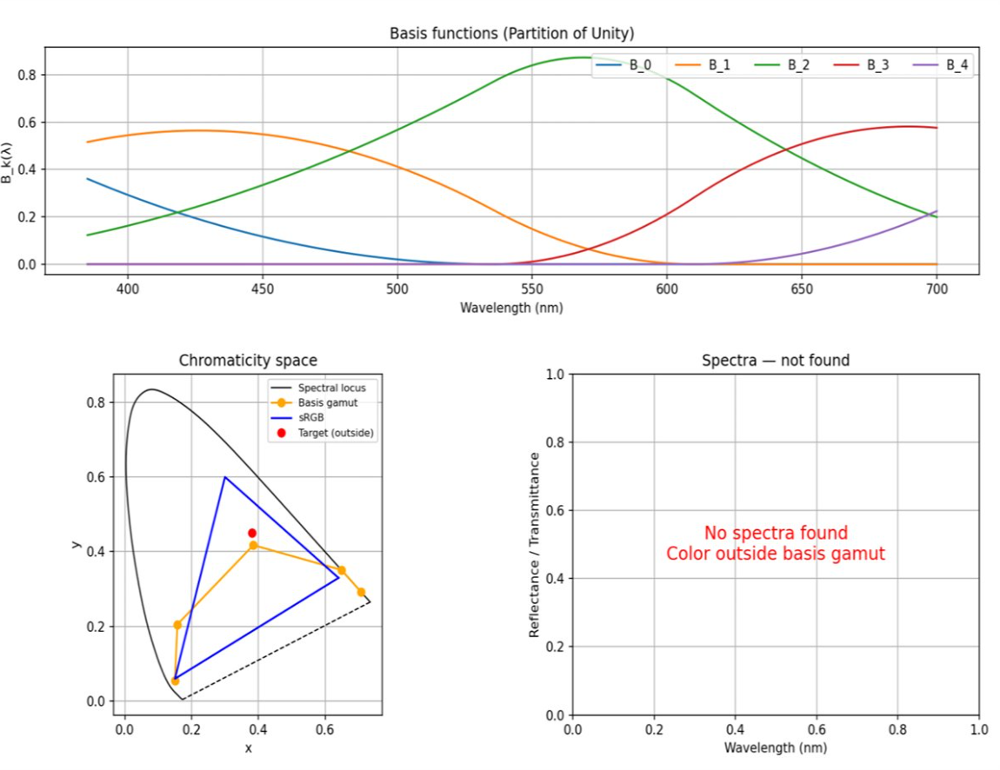

[Русская версия](README.md)

# One-to-Many Spectral Upsampling of Reflectances and Transmittances

Implementation of the algorithm from the paper *L. Belcour, P. Barla, G. Guennebaud — "One-to-Many Spectral Upsampling of Reflectances and Transmittances"* (Eurographics Symposium on Rendering, 2023).

## Problem

**Spectral upsampling** — converting RGB colors to spectral curves — is essential for physically-based spectral rendering. Existing methods provide only **one-to-one** mappings: one RGB triplet → one unique spectrum. This prevents reproduction of effects such as:

- **Dichroism** — change in material color depending on optical depth (generalization of the Usambara effect observed in tourmalines).
- **Metamerism** — different color appearance of the same material under different lighting sources.

The alternative **Metameric Blacks** approach requires tracking strict constraints for discretized spectra in high-dimensional space, is not adapted for nonlinear effects, and may have no solution for certain target colors.

## Solution

The algorithm builds a **one-to-many** mapping: for a given RGB color, an entire **equivalence class** of spectra is generated. Users can select from this class a spectrum with desired properties (e.g., a specific color at large optical depth).

---

## Algorithm

### 1. Partition of Unity (PU) Construction

The foundation of the method is a set of $K$ basis functions $B_k : U \to \mathbb{R}$, $k \in [0, K-1]$, implemented as non-uniform quadratic B-splines over the visible wavelength interval $U = [385 \text{ nm}, 700 \text{ nm}]$.

The basis satisfies the **partition of unity** property:

$$\sum_k B_k(x) = 1, \quad \forall x \in U$$

Key consequence: if all weights $w_k \in [0, 1]$, then the reconstructed spectrum $f(x) = \sum_k w_k B_k(x)$ also lies in $[0, 1]$, automatically guaranteeing physical correctness (energy conservation) for reflectance and transmittance spectra.

### 2. Geometric Interpretation in Chromaticity Space

Each basis function, when integrated with CIE sensitivity functions $\mathbf{s}(\lambda) = [\bar{x}(\lambda), \bar{y}(\lambda), \bar{z}(\lambda)]^{\top}$, yields an XYZ color:

$$\mathbf{B}_k = \int B_k(\lambda) \mathbf{s}(\lambda) \, d\lambda$$

A spectrum $f(\lambda) = \sum_k w_k B_k(\lambda)$ produces XYZ color $\mathbf{F} = \sum_k w_k \mathbf{B}_k$.

Converting to chromaticity $\mathbf{c} = [c_x, c_y]^{\top}$:

$$\mathbf{c} = \sum_k a_k \mathbf{b}_k$$

where $\mathbf{b}_k = \frac{[B_{k,X}, B_{k,Y}]^{\top}}{|B_k|}$ are **basis chromaticities** (vertices of the polygon — *basis gamut* in chromaticity space), and

$$a_k = \frac{w_k |B_k|}{\sum_l w_l |B_l|}$$

are **homogeneous barycentric coordinates**. For $K > 3$, the coordinates $a_k$ are generalized barycentric coordinates and **not unique** — this enables the one-to-many mapping.

### 3. Finding the Equivalence Class

#### 3.1. Achieving Target Chromaticity

Target chromaticity $\mathbf{c}$ is expressed through the system:

$$\begin{bmatrix} 1 & 1 & \cdots & 1 \\ b_{0,x} & b_{1,x} & \cdots & b_{K-1,x} \\ b_{0,y} & b_{1,y} & \cdots & b_{K-1,y} \end{bmatrix} \begin{bmatrix} a_0 \\ \vdots \\ a_{K-1} \end{bmatrix} = \begin{bmatrix} 1 \\ c_x \\ c_y \end{bmatrix}$$

**Step 1.** Select a triangle from three basis vertices containing $\mathbf{c}$. Compute standard barycentric coordinates $\mathbf{a}_T = [a_0, a_1, a_2]^{\top}$ relative to this triangle; set remaining coordinates $\mathbf{a}_F = [a_3, \dots, a_{K-1}]^{\top}$ to zero.

**Step 2.** The remaining $K - 3$ coordinates $\mathbf{a}_F$ represent **degrees of freedom**. Each element $a_{3+n}$ is randomly generated in the interval $[0, a_{3+n}^{\max}]$, where the upper bound is computed iteratively:

$$a_{3+n}^{\max} = \min_{i \in \{0,1,2\}} \frac{a_i + H(m_{in}) - 1 - \sum_{l=0}^{n-1} m_{il} a_{3+l}}{m_{in}}$$

Here $M = T^{-1}F$ is a $3 \times (K-3)$ matrix, and $H(m)$ is the Heaviside function accounting for element signs.

For each vector $\mathbf{a}_F$, compute displacement $\Delta\mathbf{a} = M \mathbf{a}_F$, and the full vector of generalized barycentric coordinates:

$$\mathbf{a} = [(\mathbf{a}_T - \Delta\mathbf{a})^{\top}, \mathbf{a}_F^{\top}]^{\top}$$

guarantees achieving the target chromaticity.

#### 3.2. Achieving Target Luminance

From the found vector $\mathbf{a}$, recover basis coefficients $\mathbf{w}$:

$$\mathbf{w}(w_0) = \begin{bmatrix} 1 \\ \frac{a_1 |B_0|}{a_0 |B_1|} \\ \vdots \\ \frac{a_{K-1} |B_0|}{a_0 |B_{K-1}|} \end{bmatrix} w_0 = L w_0, \quad w_0 \in (0, w_0^{\max}]$$

where

$$w_0^{\max} = \min \left\{1, \frac{a_0|B_1|}{a_1|B_0|}, \dots \right\}$$

ensures $\mathbf{w} \in [0, 1]$.

The value of $w_0$ achieving target luminance $F_Y$:

$$w_0^{\star} = \frac{F_Y}{L^{\top} \mathbf{B}_y}$$

If $w_0^{\star} \leq w_0^{\max}$, luminance is achieved. Otherwise, rescale the spectrum:

$$\mathcal{W}(\mathbf{w}) = \frac{\mathbf{w}(w_0^{\max})}{\max \left( f^{\max}, \frac{\mathbf{w}(w_0^{\max})^{\top} \mathbf{B}_Y}{F_Y} \right)}$$

where $f^{\max} = \max_\lambda f(\lambda)$.

**A priori feasibility check**: solve a linear programming problem — maximize $\overline{\mathbf{w}}^{\top} \mathbf{B}_y$ subject to $0 \leq \overline{\mathbf{w}} \leq 1$ and $A \overline{\mathbf{w}} = 0$, where

$$A = [T \; F] \, \text{diag}(|\mathbf{B}|)^{\top} - |\mathbf{B}|^{\top} \begin{bmatrix} 1 \\ \mathbf{c} \end{bmatrix}$$

### 4. Basis Optimization

#### 4.1. B-spline Knot Deformation

To expand the *basis gamut* (to cover sRGB gamut), apply knot deformation using the function:

$$C_{s,p}(x) = \begin{cases} 
\frac{x^c}{p^{c-1}} & \text{if } x \in [0, p] \\[0.3em]
1 - \frac{(1-x)^c}{(1-p)^{c-1}} & \text{otherwise}
\end{cases}, \quad c = \frac{2}{1+s} - 1$$

Parameters $(s, p) \in [0,1]^2$ control deformation strength and position. Deformed knots:

$$\kappa_k = U_0 + C_{s,p}(u_k)(U_1 - U_0)$$

where $u_k$ is a uniform sequence on $[0, 1]$.

Boundary knots are shifted 100 nm beyond $U$ for smooth spectrum decay outside the visible range.

#### 4.2. Balancing Expressiveness and Smoothness

Two metrics guide optimal parameter selection:

- **Excess area** $\mathcal{A}$ — signed area between basis gamut and sRGB gamut (normalized). Larger $\mathcal{A}$ means more expressive basis.
- **Smoothness** $\mathcal{S} = \min_k \text{FWHM}_k$ — minimum full width at half maximum among all basis functions. Larger $\mathcal{S}$ means smoother spectra.

For given $K$, enumerate all $(s, p)$ combinations. Select the one that **maximizes** $\mathcal{A}$ subject to $\mathcal{S} > 20 \text{ nm}$.

### 5. Applications

#### Dichroism

Spectra from the equivalence class are interpreted as transmittance at unit optical depth $T_1(\lambda)$. Beer-Lambert-Bouguer law at depth $d$:

$$T_d(\lambda) = T_1(\lambda)^d$$

Different spectra in the class yield different colors as $d$ increases, reproducing the Usambara effect.

#### Metamerism

Multiply basis functions by illuminant spectrum $I(\lambda)$:

$$B_k^I(\lambda) = B_k(\lambda) I(\lambda)$$

Different illuminants (D65, F2) yield different gamuts, enabling generation of spectra matching under one light but differing under another.

---

## Running

```bash
python method.py
```

The program takes the number of basis functions $K$, finds optimal deformation parameters $(s, p)$, and reconstructs the equivalence class of spectra for given chromaticity and luminance values.

## Examples

### Successful Spectrum Generation ($K = 7$)

Target chromaticity $(x = 0.38, y = 0.45)$ lies inside the basis gamut. The algorithm successfully generates 218 distinct spectra, all reproducing the same color.



Top plot: 7 basis functions (Partition of Unity) with deformed knots. Bottom left: chromaticity space with orange polygon (basis gamut) containing the target point (black). Bottom right: equivalence class of spectra.

### Failed Spectrum Generation ($K = 5$)

Target chromaticity lies outside the basis gamut. No set of weights $w_k \in [0, 1]$ can reproduce this color — the algorithm correctly reports impossibility.



For small $K$, the basis gamut is too narrow and doesn't fully cover sRGB gamut. Solution: increase $K$ and/or apply knot deformation.

## References

- [Paper (arXiv)](https://arxiv.org/abs/2306.11464)
- Belcour L., Barla P., Guennebaud G. *One-to-Many Spectral Upsampling of Reflectances and Transmittances.* Computer Graphics Forum, Volume 42, Number 4, 2023.
